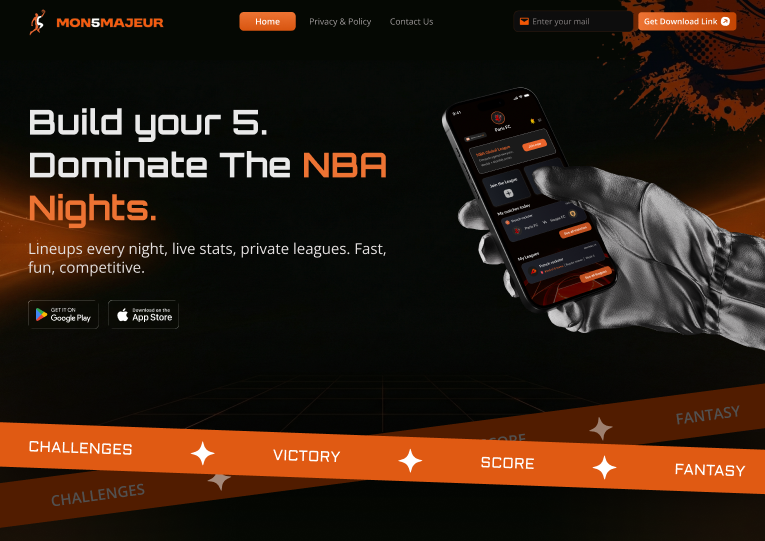
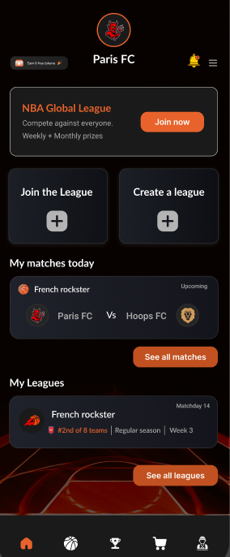
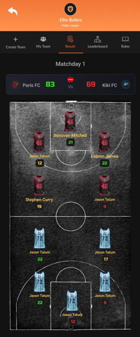

# 🏀 MON5MAJEUR

> **Build your 5. Dominate the NBA Nights.**

MON5MAJEUR is a modern **NBA Fantasy Basketball** platform where users can create fantasy teams, join leagues, compete against friends, and track live scores. Built with Django REST Framework, featuring real-time updates via WebSockets, Docker deployment, and AWS integration.

🌐 **Website**: [mon5majeur.com](http://mon5majeur.com/)  



---

## ✨ Features

### 🎮 Core Gameplay
- **Fantasy Team Building** - Draft your dream team of 5 NBA players within a budget
- **Private Leagues** - Create or join private leagues with friends (4-10 teams)
- **Live Scoring** - Real-time score tracking during NBA games
- **Leaderboards** - Compete for the top spot in weekly and monthly rankings

### 📱 User Experience
| Feature | Description |
|---------|-------------|
| **Team Management** | Create teams, manage player rosters, and track performance |
| **Match Tracking** | View upcoming and past matches with detailed stats |
| **League Dashboard** | See all your leagues, standings, and matchday results |
| **Notifications** | Get updates on matches, trades, and league events |

<p align="center">
  
  
</p>

---

## 🏗️ Tech Stack

| Category | Technology |
|----------|------------|
| **Backend** | Django 5.x, Django REST Framework |
| **Authentication** | JWT (SimpleJWT), django-allauth, dj-rest-auth |
| **Real-time** | Django Channels, Redis, WebSockets |
| **Database** | PostgreSQL (prod), SQLite (dev) |
| **Storage** | AWS S3 (via django-storages, boto3) |
| **Server** | Gunicorn, Uvicorn, Nginx |
| **Containerization** | Docker, Docker Compose |
| **Package Manager** | UV (fast Python package manager) |

---

## 📁 Project Structure

```
MON5MAJEUR/
├── apps/
│   ├── admin_panel/     # Admin dashboard functionality
│   ├── games/           # NBA game data and schedules
│   ├── leaderboard/     # Ranking and scoring systems
│   ├── leagues/         # Private & public league management
│   ├── matches/         # Match scheduling and results
│   ├── notifications/   # Push notifications system
│   ├── payments/        # Payment processing
│   ├── players/         # NBA player data and stats
│   ├── scoring/         # Fantasy scoring logic
│   ├── teams/           # User team management
│   └── users/           # User profiles and authentication
├── core/                # Django project settings
├── static/              # Static files (CSS, JS, images)
├── staticfiles/         # Collected static files
├── Dockerfile           # Docker container configuration
├── docker-compose.*.yml # Development and production configs
├── pyproject.toml       # Python dependencies (UV)
└── manage.py            # Django management script
```

---

## 🚀 Getting Started

### Prerequisites

- Python 3.12+
- [UV](https://docs.astral.sh/uv/) (recommended) or pip
- Redis (for WebSockets and caching)
- Docker (optional, for containerized deployment)

### Installation

1. **Clone the repository**
   ```bash
   git clone https://github.com/your-username/MON5MAJEUR.git
   cd MON5MAJEUR
   ```

2. **Create environment file**
   ```bash
   cp .env.example .env
   # Edit .env with your configuration
   ```

3. **Install dependencies with UV**
   ```bash
   uv sync
   ```

4. **Run migrations**
   ```bash
   uv run python manage.py migrate
   ```

5. **Create a superuser**
   ```bash
   uv run python manage.py createsuperuser
   ```

6. **Start the development server**
   ```bash
   uv run python manage.py runserver
   ```

   The API will be available at `http://127.0.0.1:8000/`

---

## 🐳 Docker Deployment

### Development
```bash
docker-compose -f docker-compose.dev.yml up --build
```

### Production
```bash
docker-compose -f docker-compose.prod.yml up --build -d
```

---

## 📡 API Documentation

Once the server is running, access the API documentation:

| Type | URL |
|------|-----|
| **Swagger UI** | `http://127.0.0.1:8000/swagger/` |
| **ReDoc** | `http://127.0.0.1:8000/redoc/` |

### Key API Endpoints

```
/api/users/           # User registration and profiles
/api/teams/           # Team management
/api/leagues/         # League creation and joining
/api/matches/         # Match data and results
/api/players/         # NBA player information
/api/leaderboard/     # Rankings and statistics
```

---

## ⚙️ Environment Variables

| Variable | Description |
|----------|-------------|
| `DEBUG` | Enable debug mode (True/False) |
| `SECRET_KEY` | Django secret key |
| `DB_ENGINE` | Database engine |
| `DB_NAME` | Database name |
| `DB_USER` | Database user |
| `DB_PASSWORD` | Database password |
| `AWS_ACCESS_KEY_ID` | AWS access key for S3 |
| `AWS_SECRET_ACCESS_KEY` | AWS secret key |
| `AWS_STORAGE_BUCKET_NAME` | S3 bucket name |

---

## 🧪 Running Tests

```bash
uv run python manage.py test
```

---

## 📄 License

This project is proprietary. All rights reserved.

---

## 🤝 Contributing

1. Fork the repository
2. Create your feature branch (`git checkout -b feature/amazing-feature`)
3. Commit your changes (`git commit -m 'Add amazing feature'`)
4. Push to the branch (`git push origin feature/amazing-feature`)
5. Open a Pull Request

---

<p align="center">
  <strong>MON5MAJEUR</strong> - Build your 5. Dominate the NBA Nights. 🏀
</p>
